#  Fido 中的 Q & A

  * [ASM 传递给认证器的信息中TAG_KEYHANDLE_ACCESS_TOKEN 是怎样生成的？有什么作用？](#1)
  *  [在注册的过程中，认证器返回X509证书的作用是？](#2)
  *  [认证器的类型有哪些？](#3)
  *   [ASM和认证器交互的过程中，如何去识别用户的身份的？（比如用户的指纹作为密码，如果支付的时候，用户变成了其他人，又识别用户是不是本人呢呢？](#4)
  *   [KeyHandle的关键作用是什么？](#5)
  *   [KeyId和KeyHandle的的关系是什么？KeyId有什么作用？](#6)
  *   [为什么在文档中认证的过程中，会用多个KeyHandle](#7)
  *   [AppId用什么作用?和facetID的区别和联系是什么?](#8)
  *   [UserVerificationToken 字段的作用是什么？在什么时候生成？](#9)
  *   [FinalChanlleageParams的作用是什么？](#10)
  *   [不同的用户使用同一个认证器，协议如何解决这个问题？](#11)
  *   [为什么会在认证的过程服务器中出现多个KeyIDs给客户端？](#12)
  *   [为什么会在认证过程中出现：通过KeyIDs查找KeyHandle的后，会有多个KeyHandle?](#13)

  <h2 id="1">Question 1</h2>
   关于这个字段的组成:文档里面的注释有： 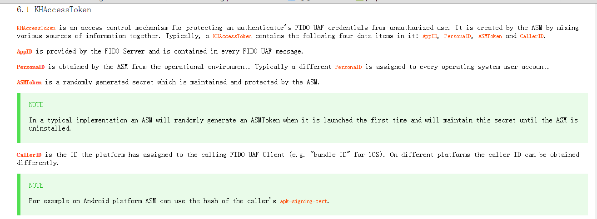 可以看到，这个字段是由  这个字段是由AppId,PersonID，ASMToken，CallerId四个字段组成的。那么KHAccessToken的又是组织这个几个字段呢？文档里面也指明了这个问题
 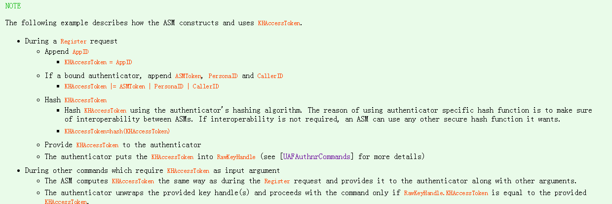可以看到，ASM拿到这个四个数据后：做了以下操作
   
   *  默认KHAcessToken为AppID
   *  如果是绑定类的认证器，KHAcessToken=AppID|ASMToken|FacetId|CallerId
   *  使用认证器自己的摘要算法，计算摘要值hash（这个字段是由AppId,  PersonID，ASMToken，CallerId组成的。）
   
 以上就是KHAcessToken的组成。  KHAcessToken 有什么作用呢？
   
  * KHAcessToken是认证器用来辨别请求的信息是否为可以信任的ASM所发的。这个字段在注册的过程会生成，会被加入KeyHandle中。然后在之后的认证过程中，ASM会再次生成这个字段（当然两次的字段是一样的），加入请求信息中去请求认证器。而认证器在认证的过程，会将注册过程的KeyHandle中的KHAcessToken来和新生成的KeyHandle进行比较，做筛选。这也就是认证器信任ASM的依据。

  <h2 id="2">Question 2</h2>
  X509证书是一种PKI技术中的一种认证方式，在注册过程中，认证器会将X509证书的信息发送给fido Server，fido sever会做根据证书做证书的信息在证书链中查找根证书，最终判定证书是否是有效的
 
 <h2 id="3">Question 3</h2> 
  认证器有四个类型，从因子数目和是否绑定两种因素，分为以下四种类型：
   
   * 一因子绑定认证器（需要把在KeyHandle里面加入username，KeyHandle交给ASM）
   * 二因子绑定认证器（不需要把在KeyHandle里面加入username，KeyHandle交给ASM）
   * 一因子非绑定认证器（需要把在KeyHandle里面加入username，KeyHandle不交给ASM）
   * 二因子非绑定认证器（不需要把在KeyHandle里面加入username，KeyHandle交给fido Sever）
   区别一因子和二因子的方式是是否加入KeyHandle 区别绑定和非绑定类型的是KeyHandle如何存储

   <h2 id="4">Question 4</h2>
 在原来的文档中注册过程：ASM操作中有这样一点： 
 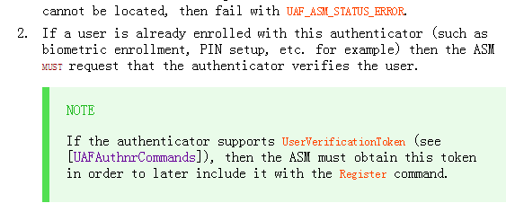 我们可以看到，认证器应该是事先就对用户的身份进行了注册，当在之后fido流程中（比如注册，认证这些过程中），ASM会事先在这个过程中，要求认证器去验证用户的信息（这个时候，认证器就可以起到识别用户的作用了）

  <h2 id="5">Question 5</h2>我们首先了解，KeyHandle的组成是什么 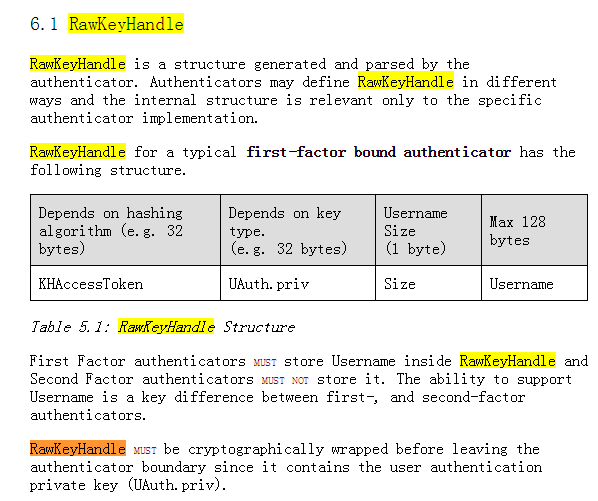 
 可以看到，keyHandle是由KHAceessToken和认证器产生的私钥构成的。我们假设现在的认证器是一因子的绑定类型认证器：那么，在认证的过程中：ASM会根据KeyIds来寻找KeyHandle，并通过KHAceesToken进行过滤，最终得到KeyHandle中的私钥，然后去签名服务器的挑战。 所以，我们可以看到，KeyHandle的有以下几个作用点： 
   
   *  放置认证器生成的私钥，用于在服务器认证的过程中，签名服务器的挑战信息，然后返回给服务器做验证签名的信息，如果验证通过，说明了用户确实可以信任。
   *  同时包含了KHAcessToken,可以让认证器信任ASM
 
  <h2 id="6">Question 6</h2>
  我们首先来看文档中如何定义KeyId的？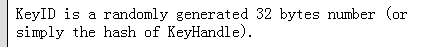可以看到，KeyId是一个32位的随机数或者是KeyHandle的一串摘要数值。那么，KeyId是用来干什么的呢？ 首先，文档中，在注册过程ASM中，指出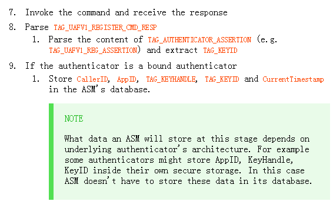,KeyId最终和KeyHanlde被存储在ASM的数据库中（一因子绑定类认证器）。之后，KeyId会发送给服务器存储。 在随后的认证过程中：文档在ASM中的认证过程中，指出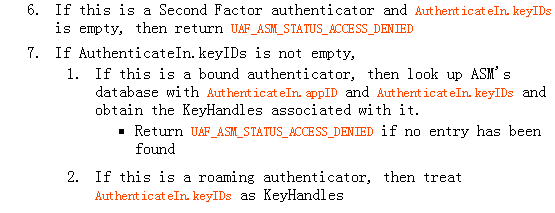  可以看到，ASM会从（一因子绑定类的认证器）之前的数据库中，拿出KeyId对应的KeyHandle，交给认证器使用。因此，我们可以看到，KeyIds的最大作用就是进行KeyHanlde的查找。

  <h2 id="7">Question 7</h2>
   为什么会出现一个KeyId对应多个keyHandle呢？因为我认为，协议中是允许一个用户用fido协议注册多个UserName的，其中包括UserName相同和不同的情况。而KeyID是一个32位的随机数字或者是KeyHanlde的摘要，那么，问题来了？（注：这里只是针对一因子的认证器）

1.若KeyId为KeyHandle的摘要，那么KeyHandle是否会重复？
2.若KeyId为一个32为的随机数，那么KeyHandle是否会重复？
我个人认为：第一种情况，一个KeyID只能找出一个KeyHanlde，而第二种情况，一个KeyID，可能会找出多个KeyHandle来。
那么，找出了多个KeyHandle后，ASM和认证器又做了什么处理呢？我们仔细看文档中的截图：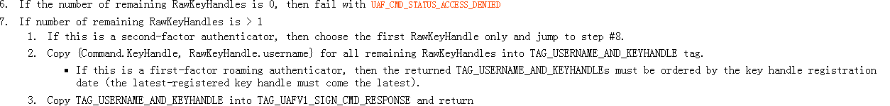这里首先从认证器出发，认证器发现有大于一个KeyHnadle，则会把KeyHandle中的UsernName都返回给认证器，然后认证器这样做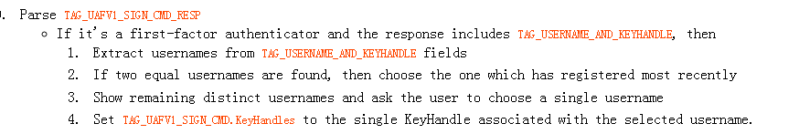认证会先找出相同的userName，然后选取最近注册过的userName，然后让从不同的用户名字中，让用户选择一个用户名字来进行确认，用户选择了之后，再将最终的KeyHandle返回给认证器。
    
  <h2 id="8">Question 8</h2>这个确实还没有搞清楚，之后看了文档仔细说
  
  
  <h2 id="9">Question 9</h2>这个字段的最关键作用就是ASM让认证器去识别用户的身份的，也是Fido协议的实现用户身份可靠性的一个关键点。无论是在fido的注册还是认证过程中，用户都是事先在认证器中注册过自己的身份的。因此，每当遇见在注册，认证过程中，ASM都会事先要求认证器验证用户身份的正确性，这时候，如果认证器认证用户成功，UserVerificationToken这个字段就会生成，然后ASM会把这个字段再次发给认证器，认证器也会再次对UserVerificationToken字段做认证。文档中截图如下所示 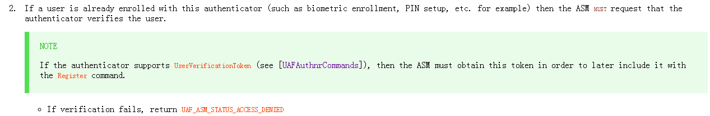 [图为注册过程中，ASM的要求认证器认证器用户身份的操作] 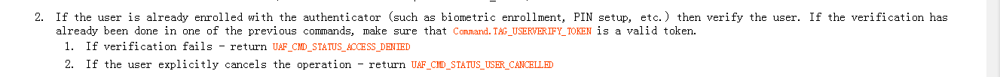 [图为注册过程，认证器收到ASM的信息后检验UserVerificationToken的操作]
  
 <h2 id="10">Question 10</h2>用于服务器验证客户是否将挑战签名成功的一个关键因素。服务器收到客户端的assertion字段之后，会解析到FinalChanlleageParams 的摘要信息(这个信息是认证器已经做好了的)，然后会通过相同的算法再次计算一次摘要信息，比对两次计算的摘要信息是否一致，如果不一致，则用户签名挑战失败，如果一致，则表示用户认证成功。 认证器的产生的私钥信息，主要用于服务器认证信息是否为客户端所发的。

 <h2 id="11">Question 11</h2>:根据文档中，ASM在认证的过程中，会出现这样一句话：!意思是说，如果用户在认证之前，没有注册过这个认证器的话，那么，认证的过程是失败的，所以，我的理解应该是，每一个用户在使用一个新的认证器之前，都要去注册（比如A用户使用认证器A做支付宝的指纹支付，B用户使用认证器B做支付宝的支付，某天B用户需要用A用户的认证器来做支付，那么，如果B用户没有注册，则首次的支付应该是失败的）(注：这种情况应该是一因子认证器的)
 
<h2 id="12">Question 12</h2>考虑上一个问题的情况，如果出现上一种情况，那么B用户在A 的认证器A上再次注册后，服务器上就会存在userName对应多个KeyId，因此，在B用户之后支付认证的过程中，服务器可能会发送多个keyIDs给客户端，让ASM去筛选那个KeyIDs才可能匹配。

 <h2 id="13">Question 13</h2>这个问题要从userName的真正含义开始解释： 首先，userName的含义不是应用的userName，而是fido协议中的一种userName。也就是说，对一个应用而言，userName是只有一个的，但是对fido而言，一个user是可以有多个userName。 举例来说:比如支付宝钱包，对一个用户而言，只有一个username，但是这个用户在支付宝中使用fido协议的时候，是可以利用fido协议注册多个userName，这多个userName可能是相同的，也可能是不同的。 
 理解了userName的含义之后，我们可以理解为什么多个KeyIDs到ASM后会找出多个KeyHandle了：因为一个用户有可能注册了多个userName，也就生成了多个属于这个user的KeyHandle，根据KeyID的计算方式来看，确实有可能让KeyIDs找出多个KeyHandle。这就是说为什么会出现多个KeyHandle的原因
