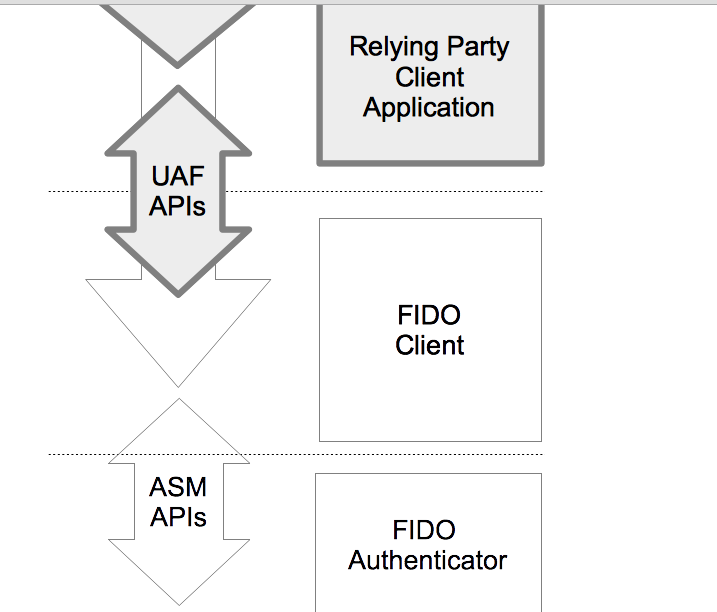
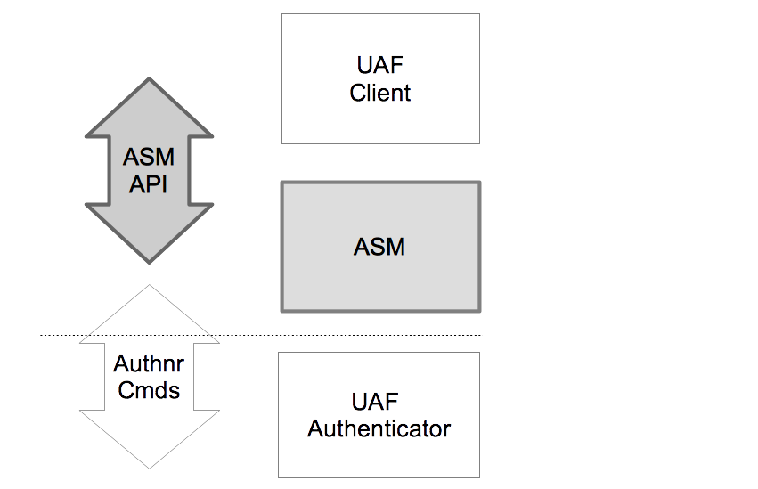
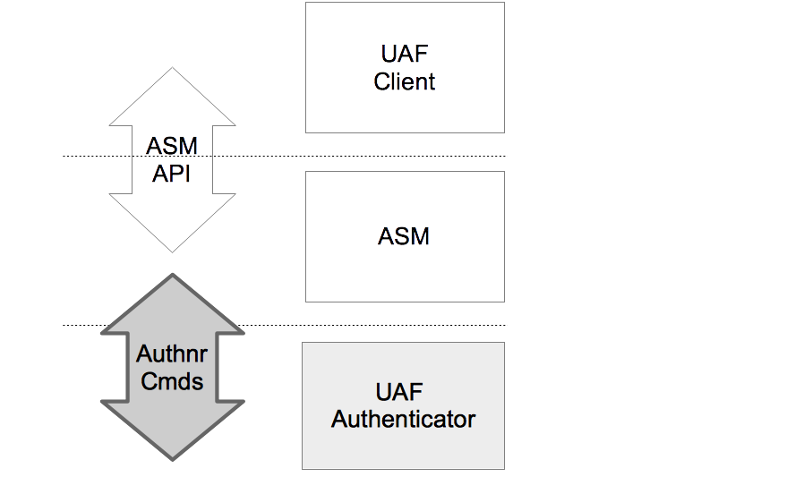
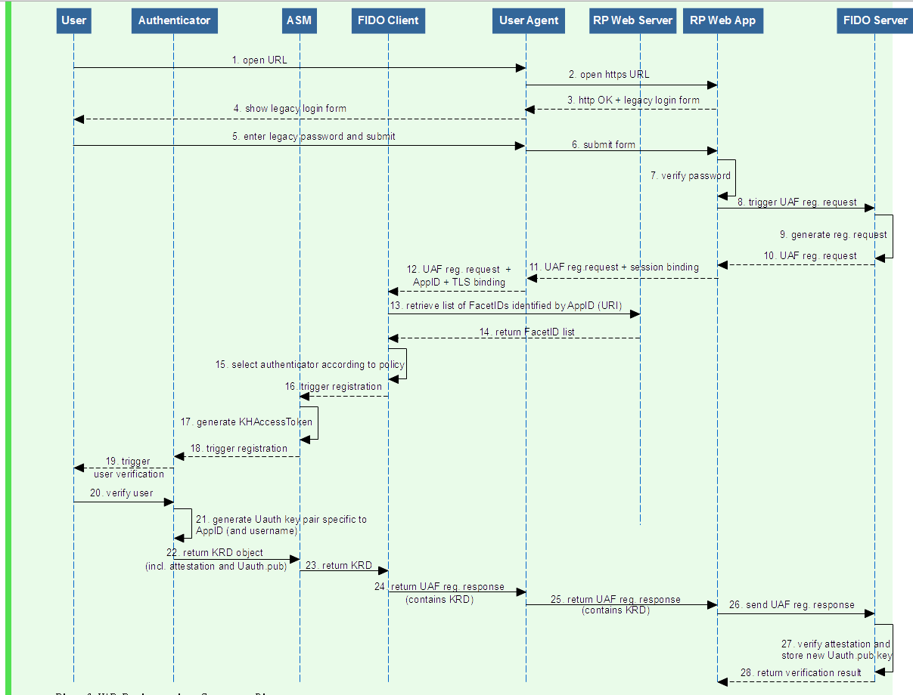
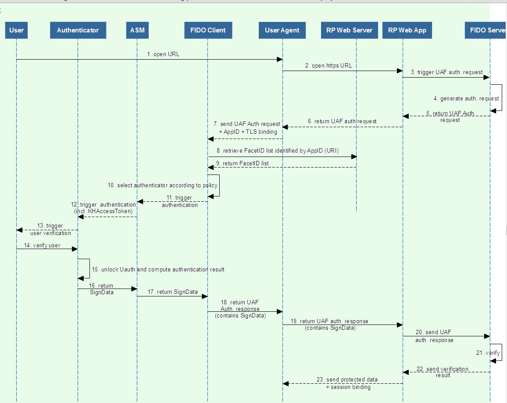

# Fido架构阐述

  1.  ##[1.总体架构](#1.1)
       1. [1.1 总体架构](#1.1)
       2. [1.2 总体流程阐述](#1.2)
  2.  ##[2.fido sever](#2.1)
  
  3. ## [3.fido Client](#3.1)
      1.  [3.1 fido client 概述](#3.1)
      1.  [3.2 fido Client API android](#3.2) 
      2.  [3.3 fido Client 同ASM交互](#3.3)
             
  4.  ## [4.fido client ASM](#4.1)
     1. [fido client ASM 概述](#4.1)   
     1. [fido client ASM 同fido Client交互](#4.2)
     2. [fido client ASM 同 fido 认证器交互](#4.3)
     
  5. ## [5. 认证器](#5.1)
     1. [认证器概述](#5.1)
     2. [fido client 认证器同 fido client ASM 的交互](#5.2)
     3. [认证器返回的信息同服务器的关联](#5.3)
  
    

  <h2>1.总体架构</h2>
   <h3 id="1.1">1.1总体架构</h3>fido协议基于传统的client-sever结构，如下图所示:从服务器端分为至上而下分为WebSever，FidoServer，FidometeDataSever，客户端至上而下分为Fido Client，ASM，Fido认证器。 接下来依次解释每一层的作用：
   
   * WebSever：一个传统的web服务器层，主要进行负责对监听client端的请求，并将数据交给fido Sever，同时会将fido Server的数据返沪给client端，封装了fido sever，让fido协议能够在传统的web形式得以实现
   
   * FidoServer：一个fido服务器，主要负责对客户端返回的数据和安全信息做逻辑处理操作，并对一些重要的数据做数据存储；同时关联fidometaSever，做安全性认证。
   
   * FidoMetaDataSever：一个fido官方的安全性认证的服务器，比如检验fido认证器的类型是否正确；认证fido认证器包含的证书是否正确。用作fido官方可信的检验。
   
* FidoClient:Fido 客户端，将整个fido包装成为一个可以调用的API，提供接口给外部的（浏览器/android/iOS）应用进行调用，同时处理服务器的发来的数据，和ASM进行数据传递。
   
   * ASM:同认证器协同交互的软件层,是认证器在软件层次的一个抽象，完成了统一各种各样的认证器在软件层次上的统一。同时对认证器的部分数据做存储。
     
   * 认证器：用于验证用户的身份，生成fido认证最关键的公钥和私钥，并且通过私钥来对服务器的挑战进行签名，是服务器认证用户的身份和fido协议最底层的一个层次，也是实现fido协议最关键的一个层次。
   
 <h3 id="1.2">1.2总体流程阐述</h3> 
1.  fido获取信息的过程：
   * Fido Client在每次接收到FidoSever的Request信息之后（任何操作流程）都要获取和ASM关联的认证器的信息，认证器的信息大致包括:authenticatorIndex; isUserEnrolled;aaid;assertionScheme; authenticationAlgorithm;userVerification等信息，用于之后在选择认证器的操作中使用。
    
1.  fido注册的过程：
    fido注册的基本流程大致阐述如下：    
     * 首先，客户端发送注册信息给fido Server(注册信息包含用户名)
     * fido Server收到客户端的请求之后，会在生成一系列的注册有关请求数据。这些请求数据包括header，挑战信息等数据
     * fido client拿到服务器的请求数据后，搜集设备商所有的认证器信息，进行挑选和匹配，选择一个合理的认证器；同时形成最终的挑战信息。最后将数据向ASM层次传递。
     * ASM收到信息之后，根据认证器索引去查找对应的认证器，命令认证器认证用户身份，如果认证通过，则使用认证器的摘要算法来生成最终挑战信息的摘要值，并且生成KHAccessToken的数据，再次请求认证器。
     * 认证器收到ASM的信息后，生成公私钥对，同时然后将公私钥对加入KeyHandle中，生成可以找到KeyHandle的KeyId，同时生成其他认证信息（比如证书信息等），并用私钥进行对上述的信息进行签名，然后将KeyHandle（加密后）和KeyId，公钥信息返回给ASM。
     * ASM拿到认证器的信息之后，根据认证器的类型，决定是否存储KeyId和KeyHandle，然后将认证器返回的信息加以封装返回给fido client
     * fido client 再次为信息进行封装处理，加入Header信息等，然后将信息发送给fido服务器
     * fido服务器收到信息后，首先验证证书有效性，组织签名数据，使用对应的公钥做验签操作，验签成功后，告诉客户端注册成功。
     * 大致的操作图如图所示：
2.  fido认证的过程：
      * 首先，客户端请求fidoserver进行验证的过程
     * fido Sever收到客户端的请求之后，会在生成一系列的认证有关请求数据（包括KeyID）
     * fido client拿到服务器的认证数据后，搜集所有可以用的认证器信息，并且让用户选择对应的认证器，同时形成最终的挑战信息。然后组织数据，向ASM层发起请求。
     * ASM收到信息之后，根据认证器索引去查找对应的认证器，命令认证器认证用户身份，如果认证通过，用认证器的摘要算法生成挑战的摘要信息，然后根据服务器发送的KeyID找到对应的KeyHanlde，并且生成KHAccessToken，将数据发送给认证器
     * 认证器收到ASM的信息后，通过KHAccessToken查找可以信任的KeyHandle，经过一系列的筛选后，找到对应的KeyHandle，然后用认证器的加密算法来解密KeyHandle.然后组织返回给服务器的数据,比如AAID，CHALLENGE,COUNTERS[引用计数器]等。最后用KeyHandle中的私钥去对要返回给fidosever的数据进行签名，将数据返回给ASM。
     * ASM拿到认证器的信息之后，做一些简单的封装，交给Fido Client。
     * fido client 再次为信息进行封装处理，加入Header信息等，然后将信息发送给fido服务器。
     * fido服务器收到信息后，织签名数据，使用对应的公钥做验签操作，若验签成功，则告诉客户端验证过程成功。
     *  大致的操作图如图所示：
 <h2 id="2.1">2.Fido Server</h2>
   <h3 id="2.1">Fido Server</h3>由于本文档主要是讲解fido客户端的，所以，fido服务器这里简单说明下功能：
    
  * 1.Fido server接受客户端的信息，并且根据操作的字段的不同，产生不一样的操作请求信息
  * 2.Fido sever具有存储数据的功能，比如存储KeyID，KeyHandle，publicKey，UserName。
  * 3.Fido sever具有验证客户端操作是否正确的功能：比如使用公钥去验证客户端返回的数据签名信息，检验挑战信息的签名是否正确，根据客户端返回证书信息去向FidoMetaDataSever查询
  * 4.Fido sever具有获取fido官方的信息的功能：比如获取到所有认证器的类型信息，加密算法信息等。

 <h2 id="3.1">3.Fido Client</h2>
   <h3 id="3.1"> 3.1 fido client 概述 </h3>fido client的是一个对外的API 接口，主要告诉了外部的应用程序应该怎么样去使用fido模型，将fido模型整个作为一个软件的API。同时，Fido Client也会对Fido Sever的数据，进行简单的处理，形成请求ASM规定的的数据类型后，发送给ASM进行调用。 
  <h3 id="3.2"> 3.2 fido client API for android</h3>关于Fido Client API的Android 版本的使用，可以参考这个链接[fido android API](fido-uaf-client-api-transport-v1.0-ps-20141208.html#android-intent-api.html)
   <h3 id="3.3">3.3 fido Client 同ASM交互</h3>Fido Client 主要接收到服务器的request信息，然后主要进行以下几点操作：
     
   * 根据服务器的发送的AppId获取facetId
   * 获取设备上可用的所有认证器信息，然后根据服务器的请求信息进行筛选，从而选出符合条件的认证器信息。
   * 暂时存储部分的服务器信息。
   * 形成FinalChallengeParams字段 。
   * 根据服务器的数据操作类型，摘选出服务器信息中的字段信息，形成对应ASMRequest可以识别的消息体，将消息发送给ASM。
   * 监听来自ASM的ASMResponse数据，并对数据做适当的封装，返回给服务器
   
   
  <h2 id="4.1">4.ASM</h2>
  <h3 id="4.1">4.1 ASM 概述</h3>ASM是各种各样的认证器在软件上的统一。ASM主要负责了接受与FidoClient沟通，进行来自FidoClient的数据的处理，并引起认证器的响应，同时，接受来自认证器的信息，并对认证器产生的关键数据做存储和查询。ASM起着连接FidoClient，统一不同类型的认证器的作用，并且能对不同类型的认证器进行交互，调用。
  
  <h3 id="4.2">4.2 ASM 同fido Client交互</h3> ASM同FidoClient的交互主要在以下几个方面：
    
  * 1.将FidoClient的请求信息中的必要的字段信息摘取出来，作为TLV格式，形成认证器的Request信息，发送给认证器。
  * 2.使用认证器自己的特定的摘要信息算法计算FinalChallengeParams的摘要数值。
  * 3.监听验证器返回的信息情况，并对验证器的信息做适当的封装，传给FidoClient。

   <h3 id="4.2">4.3 ASM 同认证器交互</h3>ASM同认证器的交互信息主要包括一下几个方面：

  *  1.ASM在形成向认证器传入请求数据之前，需要让调用认证器去验证用户身份。
  *  2.ASM会形成KHAccessToken，作为认证器可以信任ASM的依据，去访问认证器
  *  3.对认证器返回的部分信息做提取和存储：若认证器是绑定类认证器，则存储KeyHandle和KeyId到认证器的数据库中，并在之后做查询，提取KeyHandle的功能。
  
  <h2 id="5.1">5.认证器</h2>
   <h3 id="5.1">5.1 认证器概述</h3>认证器是根据用户注册的人体特征来对用户进行身份识别的硬件机器，这里的人体特征包括指纹，声音，虹膜等各种各样的信息，当然也就对应各种各样的认证器，比如指纹认证器，声音认证器，虹膜认证器。
   <h3 id="5.2">5.2 认证器和ASM的关系</h3>认证器和ASM一个实现了fido协议的硬件端。一个实现了fido的协议硬件向软件过渡的桥梁。ASM和认证器的关系主要体现在：

* 1.认证器通过ASM进行数据的交互，ASM将数据（比如KeyHandle，KHAccessToken等）交给认证器做逻辑处理，同时，认证器也将重要的信息交给ASM（KeyID，KeyHandle等等），同也有向fidoSever的交互的信息（签名信息，挑战信息，公钥等），也需要通过ASM来向上传递。
* 2. 认证器协同配合ASM做用户身份认证：ASM在每次操作之前，都让认证器去验证用户的身份是否正确，这里体现了认证器基于人体特征的身份识别功能。
* 3.根据用户的人体特征来产生公钥私钥对，并且具有自己的hash算法，让ASM用认证器特定的算法来生成挑战的摘要信息，用于服务器的之后的认证过程。