# fido 操作流程阐述 

 1. ## [GetInfo操作](#1.1)
    1. [GetInfo操作的目的](#1.1)
    2. [GetInfo操作具体步骤程以及数据演变](#1.2)
       * [1.Fido Client](#1.2.1)
       * [2.ASM](#1.2.2)
       * [3.认证器](#1.2.3)
       * [4.ASM](#1.2.4)
       * [5.Fido Client](#1.2.5)

 2. ## [Register操作](#2.1)
     1. [Register操作的目的](#2.1)
     2. [Register操作具体流程以及数据演变](#2.2)
       * [1.Fido Client](#2.2.1)
       * [2.Fido Server](#2.2.2)
       * [3.Fido Client](#2.2.3)
       * [4.ASM](#2.2.4)
       * [5.认证器](#2.2.5)
       * [6.ASM](#2.2.6)
       * [7.Fido Client](#2.2.7)
       * [8.Fido Server](#2.2.8)
       
 3. ## [Authenticate 操作流程](#3.1)
    1. [Authenticate操作的目的](#3.1) 
    2. [Authenticate操作具体流程以及数据演变](#3.2)
       * [1.Android client app](#3.2.1)
       * [2.Fido Server](#3.2.2)
       * [3.Fido Client](#3.2.3)
       * [4.ASM](#3.2.4)
       * [5.认证器](#3.2.5)
       * [6.ASM](#3.2.6)
       * [7.Fido Client](#3.2.7)
       * [8.Fido Server](#3.2.8)
      
 
 4. ##[Deregistration 操作流程](#4.1)
    1. [Deregistration 操作的目的](#4.1)
    2. [Deregistration 操作具体流程以及数据演变](#4.2)
       * [1.android client app](#4.2.1)
       *  [2.FidoServer](#4.2.1)
       *  [3.FidoClient](#4.2.2)
       *  [4.ASM](#4.2.3)
       *  [5.认证器](#4.2.4)
       *  [6.FidoClient](#4.2.5) 

  <h2 id="1.1">1.GetInfo操作</h2>
  <h3 id="1.1">1.1 GetInfo操作的目的</h3>GetInfo操作的目的是为了获取认证器的详细信息，为什么要获取认证器的详细信息呢？因为一个设备上，可能集成了很多个认证器（比如指纹认证器，声音认证器，虹膜认证器等），fido协议规定，用户一次只能使用一种认证器来进行fido认证，那么，FidoClient需要根据服务器的policy来筛选服务器认可的认证器，并且让用户选择认证器，继而在之后数据传递操作中，告诉ASM选择哪种认证器来进行操作。

  FidoClient每次在收到fidoServer的Request的信息之后，都会解析policy字段，具体操作流程如下所示：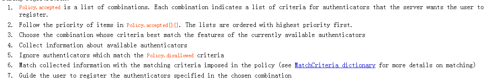 我们可以看到，Fido Client会根据服务器的policy和获取本地认证器的信息来进行后续的步骤
 
  <h3 id="1.2">1.2 GetInfo操作具体步骤程以及数据演变的</h3>
   1. <h5 id="1.2.1">Fido Client:</h5>首先FidoClient收到服务器的消息后，向 ASM发出获取Info的请求，这个请求体的格式为： 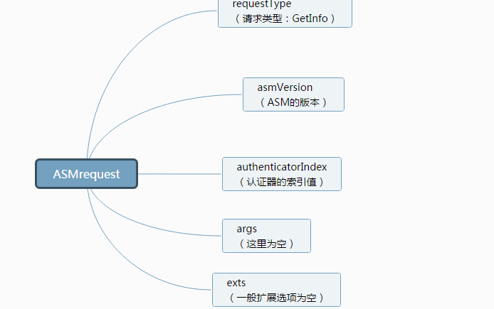
   2. <h5 id="1.2.2">ASM:</h5>ASM收到请求消息后，做如下操作：
     * 1.首先列举出在该设备上且ASM支持的认证器
     * 2.向所有的认证器发送GetInfo指令
     * 向认证器发送信息的结构截图所示：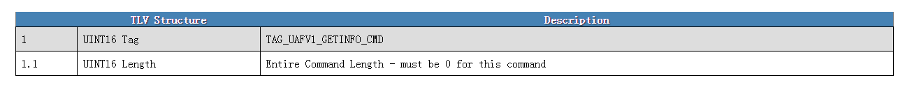
   3. <h5 id="1.2.3">认证器:</h5>认证器收到GetInfo的请求后，GetInfo返回体，然后把认证器的详细信息返回给ASM
   4. <h5 id="1.2.4">ASM:</h5>ASM收到信息后，基本不做过多处理，简单组织信息后，直接返回给FidoClient,返回的信息体如下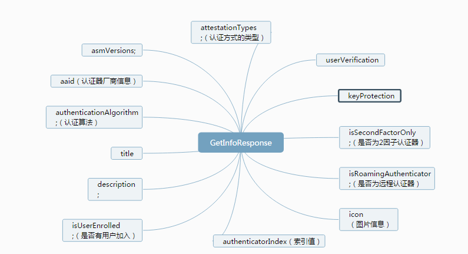 可以看到，返回信息的中含有，比如认证器的索引值，认证器的AAID，认证器的类型等等关键信息/
   5. <h5 id="1.2.5">Fido Client:</h5>Fido Client收到信息之后，会将服务器的policy中的信息和认证器信息进行匹配，进行筛选符合服务器要求的认证器的工作，并让用户选择筛选过后的认证器来进行之后的注册，认证等操作。

 
 <h2 id="2.1">2.Register操作</h2>
   <h3 id="2.1">2.1 Register操作</h3>注册操作主要是为用户的认证操作做准备。在注册操作中，认证器会生成之后认证过程最关键的公私钥对，KeyHandle，KeyId等重要数据，为之后的认证过程能够认证用户身份做数据铺垫。
    
   <h3 id="2.2">2.2 Register操作具体流程以及数据演变</h3> 

 1. <h5 id="2.2.1">1.Fido Client:</h5> fidoClient首先会发送如下图所示的信息给Fido Server：
 2. <h5 id="2.2.2">Fido Server</h5>Fido Server收到请求后，组织如下数据信息，发送给Fido Client（注：由于本篇文档是主要阐述关于客户端的，因此，服务器如何组织信息，本文档这里不做解释）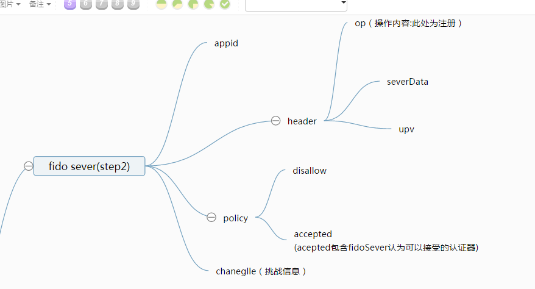 我们可以看到，服务器的信息包含：header[upv,severData,op],policy[accpted,disallow],AppId,challenge的信息.
 3. <h5 id="2.2.3">Fido Client</h5> FidoClient 收到第前一步的服务器发送的信息后，做如下操作:
      
  * 1.用json解析upv中的major version和minor versionn是否1，0；
  * 2.用json解析服务器发送的全部信息
  * 3.根据消息中的policy字段来筛选符合服务器要求的认证器，具体的筛选步骤如下：
       * 解析policy里面的信息（policy里面的信息都是FidoServer认可的，用户可以注册的认证器）
       * 根据设备上最近较常使用的认证器来优先选择policy信息里面的组合
       * 搜集所有可用的认证器信息（GetInfo操作）
       * 排除有信息在policy.disallowed的认证器
       * 找到匹配policy.accepted中包含的认证器.
       * 引导用户使用匹配成功的认证器（让用户选择匹配成功的认证器）
 *  4.根据AppID来获取FacetId，具体的操作如下：
 
    *  如果AppId并非是Https开头的来链接，而且符合facetID的规范，那么，AppId也就是所谓的faceId，FidoClient继续后续的操作
   *  如果AppId为空，则客户端需要用facetId来
   *  如果AppId为https开头的URL，则根据AppId确定FacetId
      
 *  5.形成FinalCallengeParams的内容，FinalCallengeParams就是appID 和challenge,facetId的json字符串的信息(Base64b编码形成的)计算方式如下 
      * FinalChallenge = base64url(serialize(utf8encode(fcp)))
 *  6.形成下图所示的信息，并将之发给ASM：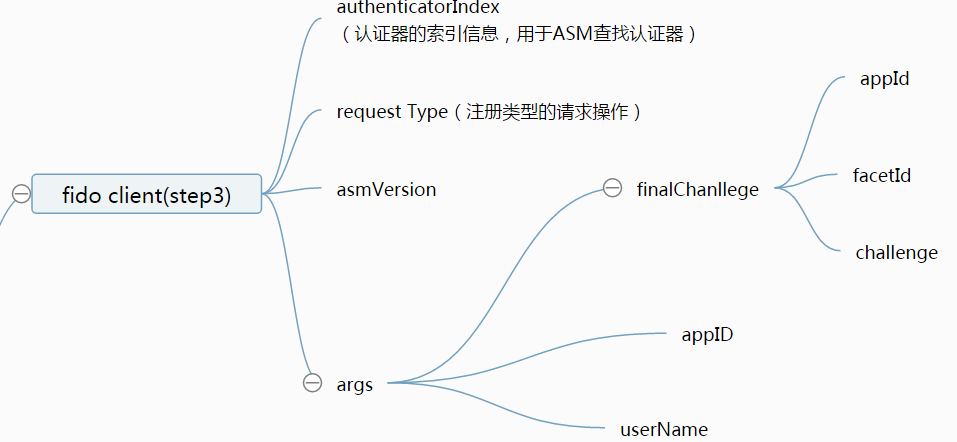 我们可以看到，包含的信息包括（认证器索引信息，操作类型，ASM版本号，请求参数[finalChallege,appID,userName]）
 
   
   <h5 id="2.2.4">4.ASM</h5>
  ASM收到请求的信息体后，做如下的操作：
  
  1. 根据authenticatorIndex找到对应的认证器，如果索引值没有找到对应的认证器，则返回错误的状态码。
  2. 如果认证器中已经有用户的身份特征信息了，则要求要求认证器验证用户的身份，并且生成UserVerificationToken字段（如果认证器支持这个字段的话）；如果认证器验证用户身份失败，则返回拒绝的状态代码。（注：UserVerificationToken认证器用户身份的依据）。
  
  3. 如果认证器中并未含有用户的身份特征信息，则要求认证器现在录入用户身份特征信息。
  4. 生成KeyHandleAccessToken的数值
      * 1.KeyHandleAccessToken=AppID（加入APPid的原因是为了防止不同的应用程序调用Fido ASM的API，会引起数据的混乱）
      * 2.如果认证器为绑定类的认证器，则： KHAccessToken |= ASMToken | PersonaID | CallerID(注：其中，ASMToken是ASM的一个特征数值，PersonID是操作系统用户名，CallerID是调用FidoClient的APP的包名)
      * 3.计算KHAccessToken的摘要数值，摘要算法是认证器内部的摘要算法:KHAccessToken=hash(KHAccessToken)
  5. 计算FinalChanllege的摘要数值（hash算法应该用认证器自己的hash算法）
  6. 生成如下图所示的信息（TLV格式），并发送给认证器：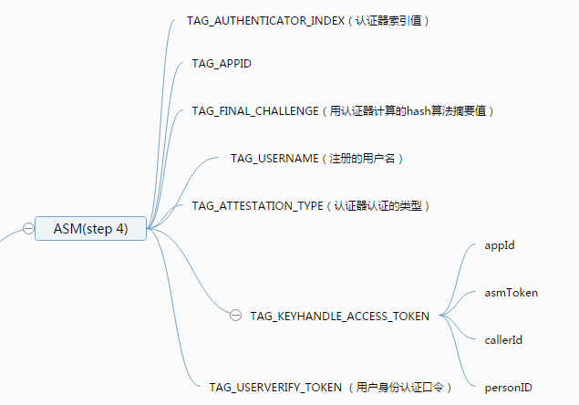
  可以看到上图的信息包括（认证器索引值，APPID，挑战的摘要值，注册的用户名，认证器的认证方式，KHAceesToken）
  
  <h5 id="2.2.5">5.认证器</h5> 认证器收到ASM的请求体之后，做如下操作： 
 
   1. 如果APPID的字段不为空，则再次更新KeyAceessToken的数值 KHAccessToken=hash(KHAccessToken | Command.TAG_APPID)
   2. 如果认证器中已经含有了用户的身份特征信息（比如用户的指纹，声音等类型的信息），认证再次认证用户身份的合法性。如果TAG USERVERIFY TOKEN字段不为空，则验证TAG USERVERIFY TOKEN字段的合法性；如果认证失败，则返回拒绝的响应状态码。  
   3. 如果认证器中没有没用用户的信息，则当场让认证器记录用户的身份特征信息，如果用户取消记录，则返回取消的状态码，如果记录失败，则返回拒绝的状态代码。
   4. 确保TAG ATTESTATION TYPE（认证方式） 是认证器支持的类型，否则返回不支持的响应的代码
   5. 以上操作都没有问题之后，产生一个密钥对(公私钥)（公钥之后会上传至服务器，私钥留在ASM的数据库中，公私钥主要是用户服务器验证挑战的签名而做的）
   6. 生成RawKeyHandle的数据:
    * .将私钥加入RawKeyHandle对象
    * .将KHAcesstoken 加入RawKeyHandle对象
    * .如果是一因子认证器，KeyHandle还要加入用户名字（username）
   7. 对RawKeyHandle进行加密(加密方式由认证器决定）(AES加密算法)，形成KeyHandle.
   8. 形成KRD的内容：（以TLV的形式）KRD的内容如下图所示：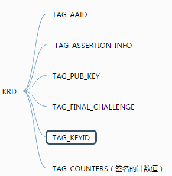 可以看到，KRD的内容是[AAID,ASSERTION_INFO,FINAL_CHALLENGE,KEY_ID,COUNTERS,PUBLIC KEY]
   9. 按照协议规范组织KRD的内容
   10. 生成签名证书TAG AUTHENTICATOR ASSERTION的内容：
      * 生成KRD的摘要信息，并且用私钥对KRD的摘要信息进行签名。
      * 由于此处是UAF 第一类认证器，那么KeyHandle和username会发送给ASM来进行保存
      * 加入X509的证书信息（用于服务器从证书链中去认证这个认证器是合法的）
      * 按照TLV的形式组织TAG AUTHENTICATOR ASSERTION的内容
   11. 将KRD和TAG AUTHkeENTICATOR ASSERTION按照TLV的形式返回给ASM，数据信息如下：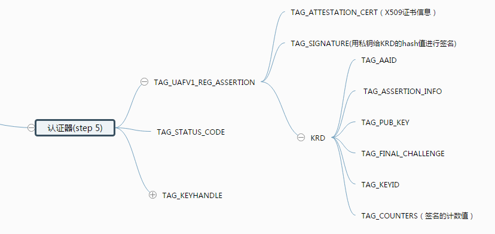
   
 <h5 id="2.2.6">6.ASM</h5>ASM收到认证返回的信息之后，做如下操作：
  
 1. 解析TAG AUTHENTICATOR ASSERTION消息体，提取出keyId的的数值
 2. 由于此处的认证器是绑定类型的认证器，则将CallerID,AppID,Keyhandle,keyId以及当前系统时间等数据一同存入ASM的数据库中。
 3. 构造向FidoClient向上传递的信息体，如下图所示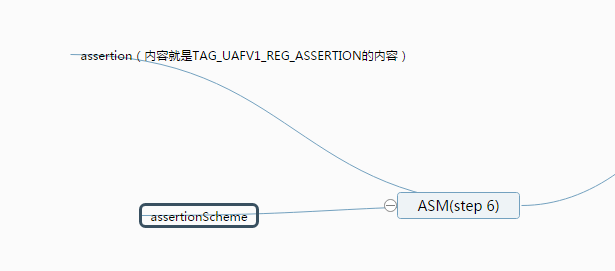
 
 <h5 id="2.2.7">7.Fido Client</h5>Fido Client收到ASM的返回的消息体之后，做如下处理： 
   
   构造向FidoServer返回的消息体
   
  * 构造头部信息：就是服务器一开始发过来的头部信息header[upv,severData,op]
  * 将一开始生成的FinalChallenge加入到fcParams的内容中。
  * 将ASM返回的消息体中的ASSERTION加入RegisterOut的内容中。
  * 形成如下图所示的消息体：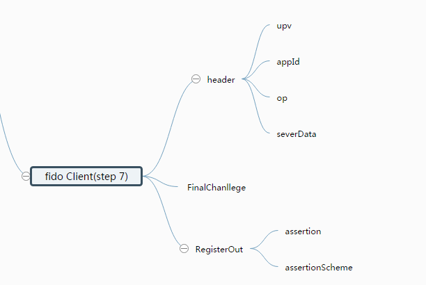
  * 将消息体发送给Fido Server

 <h5 id="2.2.8">8.Fido Sever</h5>FidoSever做后续处理，比如存储KeyID，验证签名是否正确等等
     
  <h2 id="3.1">3.Authenticate操作</h2>
   <h3 id="3.1">3.1 Authenticate操作的目的</h3>认证操作的主要目的是就是认证用户身份的合理性。因为用户已经在注册的过程中生成了一系列的数据：比如KeyID，KeyHandle等，这些数据就需要在认证的过程中为整个fido体系所用，来认证用户的身份是否符合认证。

   <h3 id="3.2">3.2 Authenticate操作具体流程以及数据演变</h3>认证过程中每一步的操作以及每一层做的具体的事情如下所示
   <h5 id="3.2.1">1.android client（APP）</h5>Fido Client向服务器发送认证的请求，这个请求应该包含用户身份认证标识（注：这里的用户指的是App的用户），比如cookie，session，token等，方便server从服务器的数据库中找到对应的keyIds来进行发送。
   <h5 id="3.2.2">2.Fido Server</h5>Fido Server组织信息如下图所示（由于本文档主要面向客户端，因此server如何组织的信息，这里略去）
   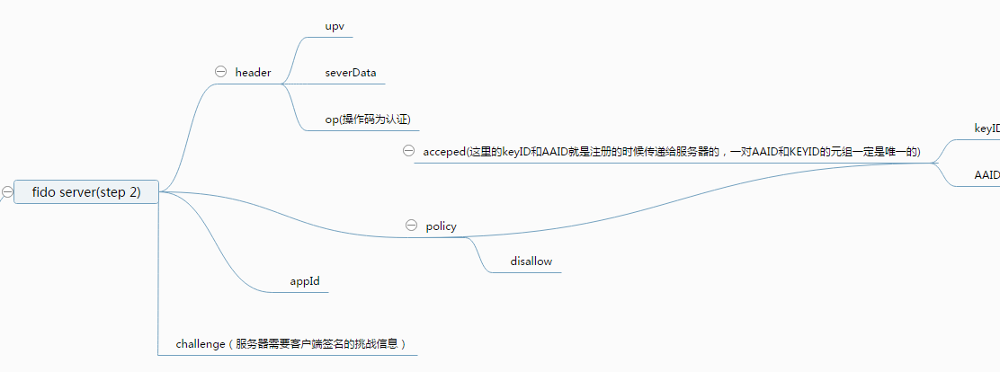 可以看到，fidosever发送的信息中，含有header[upv,severData,op],challenge,policy[accpeted[keyid,aaid],disallow],其中，keyID和AAID是在注册过程认证器留在服务器上的数据库中的数据元组。
   <h5 id="3.2.3">3.Fido Client</h5>FidoClient收到FidoServer的消息后，作如下操作：
    
   * 用json解析信息服务器的报文体
   * 根据AppID获取到faceID：
   
       *  如果AppId并非是Https开头的来链接，而且符合facetID的规范，那么，AppId也就是所谓的faceId，FidoClient继续后续的操作
       *  如果AppId为空，则客户端需要用facetId来
       *  如果AppId为https开头的URL，则根据AppId去可信任的网站来获取FacetId。
    上述根据AppId获取facetId的过程，总结起来就是：如果AppId是一个可信的链接源，则根据AppId获取facetId。否则，AppId就是facetId的原型。
      
   * 根据policy的信息，筛选出符合的认证器:（筛选过程其实和注册的过程是基本一样的）
      * 根据经常使用的认证器信息来选择policy.accpted的中的组合信息。
      * 搜集所有可用的认证器信息。
      * 如果有认证器的信息在符合policy.disallowed中的信息，则忽略这些认证器。
      * 根据policy中的信息来匹配认证器的信息。
      * 然后让用户从匹配成功的认证器挑选一个进行认证。
      
   * 找到匹配的认证器后，让用户从中选择一个认证器(也就是找到authenticatorIndex)。
   * 形成FinalChallenge的信息，计算方法和注册时候的是一样的。
   * 形成如下图的格式的请求数据，交给ASM.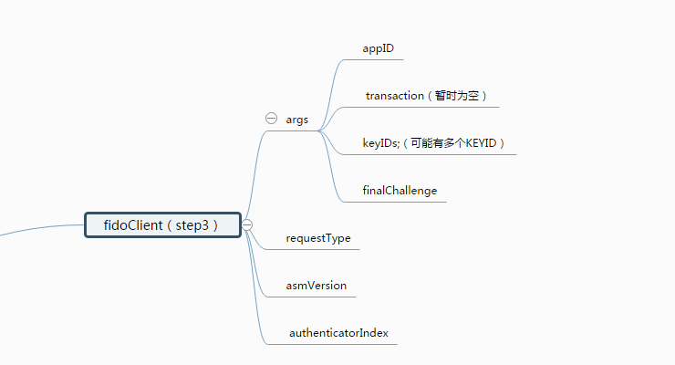
       
   <h5 id="3.2.4">4.ASM</h5>ASM收到信息后，做如下的操作：

   1. 根据authenticatorIndex找到对应的认证器
   2. 如果认证器中没有用户的身份特征信息，则返回拒绝的响应状态码
   3. ASM要求认证器去检验用户的身份，如果用户的身份检验失败，则返回被拒绝的响应字段
        
    * 如果认证器支持UserVerificationToken这个字段，则将UserVerificationToken这个字段也发给认证器
  4. 生成KeyHandleAcessToken的数值，这个计算的方式和注册的时候的一样的（KeyHandleAcessToken主要用于认证器去信任ASM的，因此两次的计算方法自然需要一致）
  5. 用认证器的hash算法计算finalChallegne的摘要 
  7. 如果keyIDs不为空（KeyID就是用来寻找KeyHandle的）
    *  由于此处为绑定类型的认证器，则通过AppId，KeyIds在ASM的数据库中去查找对应的KeyHandles（AppId的主要目的是为了区分不用的android APP使用Fido协议产生的数据，而KeyId主要是来查找对应的keyHandle）
         
  
 8.形成如下的信息格式发送给验证器 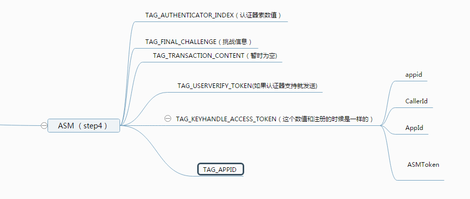
        
  <h5 id="3.2.5">5.认证器</h5>认证器收到请求后，做如下的操作：
   
  1. 更新KeyAcessToken的数值（计算方法和注册过程是一样的）
  2. 如果认证器中有用户的身份特征信息（比如指纹，虹膜等）则验证用户的身份是否正确，并且验证UserVerificationToken字段是否有效
     * 如果验证失败，则返回拒绝的状态码
     * 如果用户有取消操作的动作，如果有，则返回取消操作的状态码
  3. 如果用户没有注册，则返回没有注册的状态码
  4. 用验证器的内部的加密算法（AES算法）解密KeyHandle的数值
  5. 用KeyAcessToken的数值来过滤第4步找到的所有的KeyHandle，比较两者的摘要是否一致。RawKeyHandle.KHAccessToken == Command.KHAccessToken（这一步骤主要用于认证器信任消息确实为ASM所发,同时区分不同的应用程序存储的KeyId）
  6. 经过过滤之后，如果KeyHandle的个数为零，则返回拒绝验证的状态码(说明了这次请求的信息不可信)
  7. 如果剩下的KeyHandle的个数的大于1
    * 形成{Command.KeyHandle, RawKeyHandle.username}的这样一对对的元组信息，放入TAG_USERNAME_AND_KEYHANDLEs字段中，然后返回给ASM（此操作说明了一个APP用户，进行了多次FidoUAF协议中的注册）
  8. 如果剩下的KeyHandle的等于1：
    * 构造ASSERTION的信息
       * 形成证书信息（证书信息包括：AAID，CHALLENGE,COUNTERS等）;COUNTERS是签名计数器，每签名一次，则计数器的数值自增，这个字段主要用于防止认证器被克隆。
       * 用私钥签名证书的信息(私钥在KeyHandle中存放，拿到KeyHandle已经做了解密处理)
    * 形成如下图所示的信息体，然后返回ASM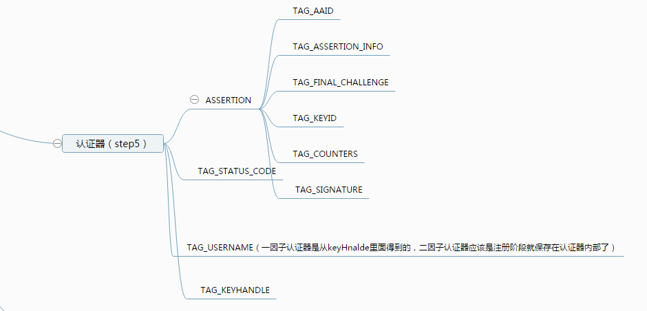
     
        
   <h5 id="3.2.6">6.ASM</h5>ASM收到认证器返回的消息之后，做如下的操作

   * 1.如果是一因子的认证器，而且 TAG_USERNAME_AND_KEYHANDLE字段不为空的话（也就是出现了多个KeyHanlde的情况）：
     * 1.从字段中提取出所有的{Command.KeyHandle, RawKeyHandle.username}元组对
     * 2.找到所有元组中是否相同username的元组，如果多个元组的userName都是相同的，则根据注册阶段在ASM的数据库中的注册时间，挑选一个注册时间最近的username元组做处理，剩下的username元组都排除掉（这里ASM做的是筛除用户进行重复的注册中，有相同的username的情况）
     * 3.如果剩下的元组的个数都还是大于1（也就是有userName不同的多个元组）则让用户选择一个username，进行认证。（这里ASM做得是筛除用户进行重复的注册中，有不同的username的情况）
     * 4.用户选择完成之后，重复[4.ASM](#3.2.4)的步骤中的第8步再次请求ASM
  * 2.如果上述条件不满足（也就是认证器已经成功完成认证了）则形成如下图所示数据，向FidoClient传递。
           
   
   <h5 id="3.2.7">7.FidoClient</h5>FidoClient收到ASM返回的数据后，做如下操作：

   * 形成Header的信息(Header信息就是fidosever开始请求的header的信息)
   * 形成将FinalChallenge的信息加入返回消息体中
   * 将ASM的信息也加入返回的消息中
   * 形成如下图所示的消息体: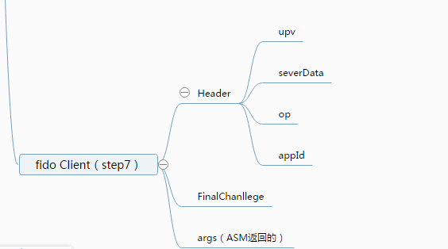
   * 发送给fidoserver

   <h5 id="3.2.8">8.FidoServer</h5>FidoSever收到消息后，做签名计数器验证，挑战的签名验证等一系列的工作

 <h2 id="4.1">4.Deregistration操作</h2>
   <h3 id="4.1">Deregistration 操作的目的</h3>顾名思义，这个单词就是注销的意思。那么，进行Deregistration的操作的目的，主要是为了将注册过程中username对应的认证器，进行解除绑定的作用。

   <h3 id="4.2">Deregistration 操作具体流程以及数据演变</h3>
   <h5 id="4.2.1">1.Android client app</h5>
   android 客户端，同认证过程的第一步一样，会把客户的身份识别信息发送给服务器，以便让服务器来进行用户身份的绑定
   <h5 id="4.2.2">2.Fido Server</h5>Fido server收到请求之后，构造如下图的数据：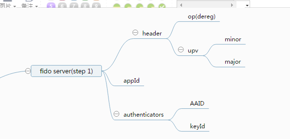服务器在构造这些数据的同时，会将注册过程中，用户对应产生的keyId和aaid从服务器的数据库中删除。
   <h5 id="4.2.3">3.Fido Client</h5>Fido Client收到请求后，做如下操作：

   1. 验证UPV的字段是否合法（这和注册，认证过程的第一步是一样的）
   2. 将AppId和facetId进行互换（这也和注册，认证过程的步骤是一样的）
   3. 构造如下图所示的请求体来进行ASM的请求。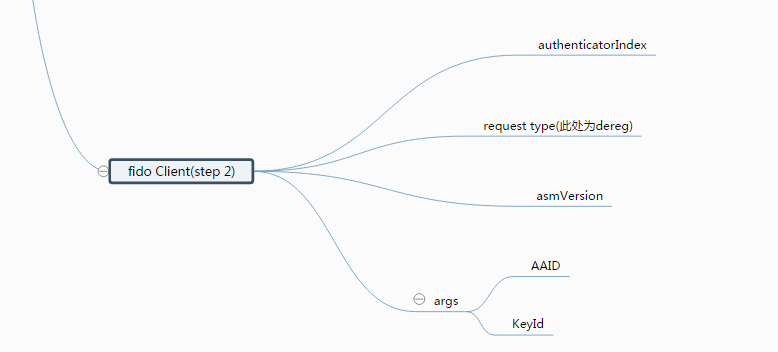
   <h5 id="4.2.3">4.ASM</h5>ASM受到请求后，做如下操作：

   1. 根据authenticatorIndex进行来定位执行操作的认证器
   2. 由于此处认证为第一类认证器，所以，注册过程中所含有的appId和KeyId是放在ASM的中的数据库中的。这时，ASM根据AppId和KeyId来数据库中对应的元组，然后进行删除。
   3. 构造KHAccessToken的数值，构造方法同之前的注册，认证过程是一样的。
   4. 形成如下图的数据格式来请求认证器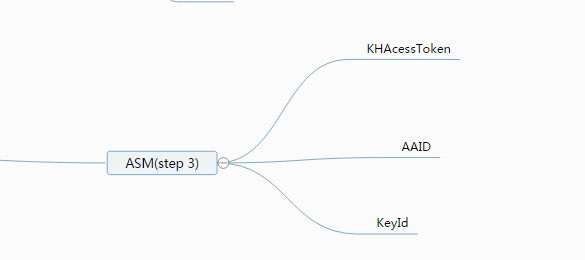
   <h5 id="4.2.4">4.认证器</h5>由于此处的认证器是第一类绑定型的认证器，认证器做的步骤很简单：

   1. 更新KeyAcessToken的数值（计算方法和注册过程是一样的）
   2. 因为这里是第一类绑定类型的认证器，所以认证器不支持内部keyHandle的内部存储，直接返回 UAF CMD STATUS CMD NOT SUPPORTED，结束dereg操作。（注：对于第一类绑定类型的认证器来说，认证器在dereg部分，本来也不做任何操作，关于其他类的认证器的dereg的操作，请参照fido官方文档）
  
   <h5 id="4.2.5">5.ASM</h5>ASM 收到认证器的返回后，如果返回的结果是 UAF CMD STATUS CMD NOT SUPPORTED或者UAF CMD STATUS OK的状态码，则返回FidoClient，dereg操作成功。

   <h5 id="4.2.6">6.FidoClient</h5>FidoClient收到数据后，如果ASM响应正确，则返回给android client app端操作成功的正确码，至此，dereg的操作全部结束。（注：dereg操作不需要再将fidoclient处理的过后的数据交给服务器处理）
   
