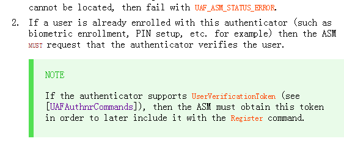
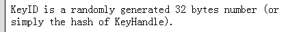

#Fido 中的 Q & A

  * [ASM 传递给认证器的信息中TAG_KEYHANDLE_ACCESS_TOKEN 是怎样生成的？有什么作用？](#1)
  *  [在注册的过程中，认证器返回X509证书的作用是？](#2)
  *  [认证器的类型有哪些？](#3)
  *   [ASM和认证器交互的过程中，如何去识别用户的身份的？（比如用户的指纹作为密码，如果支付的时候，用户变成了其他人，又识别用户是不是本人呢呢？](#4)
  *   [KeyHandle的关键作用是什么？](#5)
  *   [KeyId和KeyHandle的的关系是什么？KeyId有什么作用？](#6)
  *   [为什么在文档中认证的过程中，会用多个KeyHandle](#7)
  *   [AppId用什么作用?和facetID的区别和联系是什么?](#8)
  *   [UserVerificationToken 字段的作用是什么？在什么时候生成？](#9)
  *   [为什么会在认证的过程服务器中出现多个KeyIDs给客户端？](#10)
  *   [FinalChanlleageParams的作用是什么？](#11)
  *   [不同的认证器使用同一个ASM，协议如何解决这个问题？](#12)
  *   [不同的用户使用同一个认证器，协议如何解决这个问题？](#13)
  *   

  <h2 id="1">Question 1</h2>
   关于这个字段的组成:文档里面的注释有：  可以看到，这个字段是由  这个字段是由AppId,PersonID，ASMToken，CallerId四个字段组成的。那么KHAccessToken的又是组织这个几个字段呢？文档里面也指明了这个问题
 可以看到，ASM拿到这个四个数据后：做了以下操作
   
   *  默认KHAcessToken为AppID
   *  如果是绑定类的认证器，KHAcessToken=AppID|ASMToken|FacetId|CallerId
   *  使用认证器自己的摘要算法，计算摘要值hash（这个字段是由AppId,  PersonID，ASMToken，CallerId组成的。）
   
 以上就是KHAcessToken的组成。  KHAcessToken 有什么作用呢？
   
  * 1.首先，KHAcessToken是用认证器的摘要算法生成的，其中ASMToken是ASM一个独自生成的字段，认证器可以通过比较两次，来判定KHAcessToken是来自ASM的，是可以信任的ASM交给认证器的信息。
  * 2.其次，在注册过程中，这个字段被加入KeyHandle中，从而交给ASM作存储（非绑定类的认证器自己存储）。在注册的过程中，ASM会生成同一个KHAcessToken，认证器需要通过这个字段来筛选和过滤多余的KeyHandle

  <h2 id="2">Question 2</h2>
  X509证书是一种PKI技术中的一种认证方式，在注册过程中，认证器会将X509证书的信息发送给fido Server，fido sever会做根据证书做证书的信息在证书链中查找根证书，最终判定证书是否是有效的
 
 <h2 id="3">Question 3</h2> 
  认证器有四个类型，从因子数目和是否绑定两种因素，分为以下四种类型：
   
   * 一因子绑定认证器（需要把在KeyHandle里面加入username，KeyHandle交给ASM）
   * 二因子绑定认证器（不需要把在KeyHandle里面加入username，KeyHandle交给ASM）
   * 一因子非绑定认证器（需要把在KeyHandle里面加入username，KeyHandle不交给ASM）
   * 二因子非绑定认证器（不需要把在KeyHandle里面加入username，KeyHandle交给fido Sever）
   区别一因子和二因子的方式是是否加入KeyHandle 区别绑定和非绑定类型的是KeyHandle如何存储

   <h2 id="4">Question 4</h2>
 在原来的文档中注册过程：ASM操作中有这样一点： 
  我们可以看到，认证器应该是事先就对用户的身份进行了注册，当在之后fido流程中（比如注册，认证这些过程中），ASM会事先在这个过程中，要求认证器去验证用户的信息（这个时候，认证器就可以起到识别用户的作用了）

  <h2 id="5">Question 5</h2>我们首先了解，KeyHandle的组成是什么  
 可以看到，keyHandle是由KHAceessToken和认证器产生的私钥构成的。我们假设现在的认证器是一因子的绑定类型认证器：那么，在认证的过程中：ASM会根据KeyIds来寻找KeyHandle，并通过KHAceesToken进行过滤，最终得到KeyHandle中的私钥，然后去签名服务器的挑战。 所以，我们可以看到，KeyHandle的有以下几个作用点： 
   
   *  放置认证器生成的私钥，用于在服务器认证的过程中，签名服务器的挑战信息，然后返回给服务器做验证签名的信息，如果验证通过，说明了用户确实可以信任。
   *  同时包含了KHAcessToken,可以让认证器信任ASM
 
  <h2 id="6">Question 6</h2>
  我们首先来看文档中如何定义KeyId的？可以看到，KeyId是一个32位的随机数或者是KeyHandle的一串摘要数值。那么，KeyId是用来干什么的呢？ 首先，文档中，在注册过程ASM中，指出,KeyId最终和KeyHanlde被存储在ASM的数据库中（一因子绑定类认证器）。之后，KeyId会发送给服务器存储。 在随后的认证过程中：文档在ASM中的认证过程中，指出  可以看到，ASM会从（一因子绑定类的认证器）之前的数据库中，拿出KeyId对应的KeyHandle，交给认证器使用。因此，我们可以看到，KeyIds的最大作用就是进行KeyHanlde的查找。

  <h2 id="7">Question 7</h2>

    
  <h2 id="8">Question 8</h2>这个确实还没有搞清楚，之后看了文档仔细说
  
  
  <h2 id="9">Question 9</h2>这个字段的最关键作用就是ASM让认证器去识别用户的身份的，也是Fido协议的实现用户身份可靠性的一个关键点。无论是在fido的注册还是认证过程中，用户都是事先在认证器中注册过自己的身份的。因此，每当遇见在注册，认证过程中，ASM都会事先要求认证器验证用户身份的正确性，这时候，如果认证器认证用户成功，UserVerificationToken这个字段就会生成，然后ASM会把这个字段再次发给认证器，认证器也会再次对UserVerificationToken字段做认证。文档中截图如下所示  [图为注册过程中，ASM的要求认证器认证器用户身份的操作]  [图为注册过程，认证器收到ASM的信息后检验UserVerificationToken的操作]
  