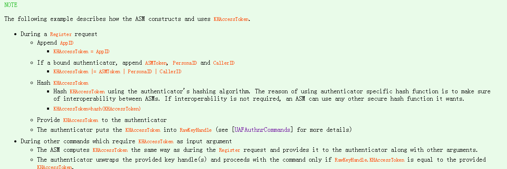

#Fido 中的 Q & A

  * [ASM 传递给认证器的信息中TAG_KEYHANDLE_ACCESS_TOKEN 是怎样生成的？有什么作用？](#1)
  *  [在注册的过程中，认证器返回X509证书的作用是？](#2)
  *  [认证器的类型有哪些？](#3)
  *   [ASM和认证器交互的过程中，如何去识别用户的身份的？（比如用户的指纹作为密码，如果支付的时候，用户变成了其他人，又识别用户是不正确的呢？](#4)
  *   [KeyHandle的关键作用是什么？](#5)
  *   [KeyId和KeyHandle的的关系是什么？KeyId有什么作用？](#6)
  *   [KeyId如果是一串随机的数字，那么，KeyHandle重复了怎么办?](#7)
  *   [AppId用什么作用?和facetID的区别和联系是什么?](#8)
  *   [UserVerificationToken 字段的作用是什么？在什么时候生成？](#9)

  <h2 id="1">answer 1</h2>
   关于这个字段的组成:文档里面的注释有：  可以看到，这个字段是由  这个字段是由AppId,PersonID，ASMToken，CallerId四个字段组成的。那么KHAccessToken的又是组织这个几个字段呢？文档里面也指明了这个问题
 可以看到，ASM拿到这个四个数据后：做了以下操作
   
   *  默认KHAcessToken为AppID
   *  如果是绑定类的认证器，KHAcessToken=AppID|ASMToken|FacetId|CallerId
   *  使用认证器自己的摘要算法，计算摘要值hash（这个字段是由AppId,  PersonID，ASMToken，CallerId组成的。）
   
 以上就是KHAcessToken的组成。  KHAcessToken 有什么作用呢？
   
  * 1.首先，KHAcessToken是用认证器的摘要算法生成的，其中ASMToken是ASM一个独自生成的字段，认证器可以通过比较两次，来判定KHAcessToken是来自ASM的，是可以信任的ASM交给认证器的信息。
  * 2.其次，在注册过程中，这个字段被加入KeyHandle中，从而交给ASM作存储（非绑定类的认证器自己存储）。在注册的过程中，ASM会生成同一个KHAcessToken，认证器需要通过这个字段来筛选和过滤多余的KeyHandle

  <h2 id="2">Question 2</h2>

 
    

